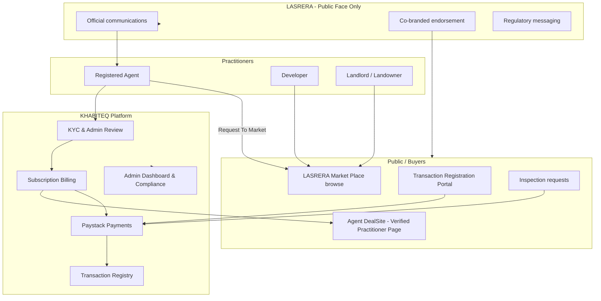

# LASRERA × KHABITEQ Partnership Structure

**Document type:** Internal strategy brief — team feedback for CEO review  
**Date:** 24 June 2026  
**Prepared by:** KHABITEQ Product & Operations (derived from current platform capabilities)  
**Deadline for team submissions:** 1:00 PM, 24 June 2026  

---

## 1. Executive Summary

LASRERA (Lagos State Real Estate Regulatory Authority) is a government agency with **4,000+ registered estate agents**. KHABITEQ has built digital infrastructure that directly supports LASRERA’s regulatory goals—particularly **Verified Practitioner Pages** (DealSites) and the **Transaction Registration Process**—while generating recurring and transaction-based revenue.

LASRERA has expressed interest in collaboration but has stated it **does not intend to handle operational, administrative, or implementation work**. It prefers to act as the **public-facing representative** of the initiative.

This document proposes a partnership structure that:

1. Aligns LASRERA’s public mandate (compliance, agent registry, buyer protection) with KHABITEQ’s technology and operations.
2. Converts LASRERA’s registered-agent base into **paying practitioner subscribers** and **transaction-registration users**.
3. Defines clear **responsibility boundaries** so LASRERA gains credibility and revenue without operational burden.
4. Recommends a **hybrid financial model** with measurable KPIs and a phased rollout.

**Recommendation:** Proceed with a **phased strategic partnership** under a formal MoU, starting with co-branded onboarding of LASRERA-registered agents and mandatory transaction-registration messaging, with revenue share tied to attributable subscriptions and registration fees.

---

## 2. Context from LASRERA Meeting (24 June 2026)

| LASRERA position | Implication for structure |
|------------------|---------------------------|
| Interested in Verified Practitioner Pages & Transaction Registration | These are live KHABITEQ modules—partnership is integration and distribution, not greenfield build |
| Will not handle operations, admin, or implementation | KHABITEQ retains 100% of platform ops; LASRERA role must be **promotional, regulatory, and reputational** only |
| Wants to be public-facing representative | Co-branding, official communications, launch events, policy endorsement—not helpdesk or KYC desk |

---

## 3. KHABITEQ Platform — System Flow Overview

The platform serves multiple actors in a connected real-estate marketplace. The LASRERA partnership primarily touches **Agents**, **Buyers**, and **compliance flows**.

### 3.1 High-level ecosystem flow

### 3.2 Agent journey (core LASRERA subscriber funnel)

| Stage | What happens on KHABITEQ | LASRERA relevance |
|-------|--------------------------|-------------------|
| **Registration** | Agent signs up (`userType: Agent`), email verification | LASRERA can drive bulk sign-up via official circular; optional LASRERA licence field |
| **Onboarding & KYC** | 7-day grace (1 listing); KYC submission → admin approval | “LASRERA-registered agent” badge after licence cross-check |
| **Trial** | Up to 10 listings for 4 weeks without paid subscription | Low-friction entry for 4,000-agent base |
| **Verified Practitioner Page** | DealSite: public slug, profile, listings, ratings, inspection settings | This is the **Verified Practitioner Page** LASRERA referenced |
| **Subscription** | Paid plan required after trial for continued listing + public page | **Primary recurring revenue** from agent base |
| **Market Place** | Agents “Request To Market” on landlord/developer listings | Extends agent reach; drives DealSite traffic |
| **Inspections** | Buyer requests → agent accepts → optional fee (₦1,000–₦50,000) | Trust layer before transaction |
| **Transaction registration** | Buyer registers sale/rent/JV/off-plan; tiered processing fee | **Primary compliance revenue** aligned with LASRERA mandate |

### 3.3 Buyer-led compliance flow (Transaction Registration)

This module is explicitly built for **LASRERA-style buyer-led compliance**:

1. Buyer completes or intends a transaction (often after inspection).
2. Buyer reviews Safe Transaction Guidelines on the public portal.
3. Buyer submits registration with property identification, ID, and proof of payment.
4. System computes processing fee by transaction value and initiates Paystack payment.
5. Property is tagged in the central registry (`transaction_registered_pending` → `sold_leased_registered` on completion).
6. Public due-diligence search allows address/GPS/property ID lookup.

**Current LASRERA fee bands (platform config):**

| Transaction value | Processing fee |
|-------------------|----------------|
| Below ₦5,000,000 | ₦0 |
| ₦5,000,000 – ₦50,000,000 | ₦100,000 |
| Above ₦50,000,000 | ₦150,000 |

### 3.4 LASRERA Market Place & Request To Market

- **Landlords and Developers** publish properties to the LASRERA Market Place (`listingScope: lasrera_marketplace`) with **no contact details** exposed.
- **Agents** request to market those properties; publishers accept or reject.
- On acceptance, properties appear on the agent’s Verified Practitioner Page (DealSite).
- Agent commission (1–5% of actual sale price) is registered post-transaction; payment is currently **outside the app** with optional receipt upload for admin verification.

This flow connects LASRERA’s registered practitioners to inventory without exposing landlord contact details—a fraud-reduction design aligned with regulatory intent.

---

## 4. Revenue Generation Model (Current Platform)

KHABITEQ revenue falls into **recurring (subscriptions)** and **transactional (fees)** streams. Understanding these is essential to structuring LASRERA’s financial benefit.

### 4.1 Revenue streams

| Stream | Who pays | Typical amount | Collected by | Notes |
|--------|----------|----------------|--------------|-------|
| **Agent subscriptions** | Registered agents | Reference pricing: Monthly ₦25,000; Quarterly ₦67,500; Yearly ₦240,000 (catalog-driven via admin) | KHABITEQ (Paystack) | Required after 4-week trial / 10-property cap; KYC required before subscribe |
| **Transaction registration fees** | Buyers / tenants | ₦100,000 or ₦150,000 (value bands) | KHABITEQ (Paystack) | Directly tied to LASRERA compliance narrative |
| **Inspection fees** | Buyers | ₦1,000 – ₦50,000 (agent-set) | KHABITEQ (Paystack) | Largely practitioner income; platform processes payment |
| **Shortlet booking fees** | Guests | Variable; ~10% platform charge on DealSite split payments | Split via Paystack sub-account | Secondary stream |
| **Document verification** | Users | Per verification product | KHABITEQ | Ancillary |
| **Request To Market commission** | Landlords / Developers | 1–5% of sale price | Off-platform (receipt optional) | Not currently a KHABITEQ revenue line |

### 4.2 Revenue strategic weight for this partnership

| Priority | Stream | Why it matters for LASRERA deal |
|----------|--------|--------------------------------|
| **1** | Agent subscriptions | 4,000 registered agents → addressable recurring base; LASRERA drives conversion |
| **2** | Transaction registration | Fulfils LASRERA public mandate; scales with market activity |
| **3** | Inspection fees | Indirect—drives trust and conversion to registration |
| **4** | Other | Lower priority in initial MoU |

### 4.3 Illustrative annual upside (conservative modelling)

*For internal discussion only—not a forecast guarantee.*

| Scenario | Assumption | Subscription revenue (gross) | Registration revenue (gross) |
|----------|------------|-------------------------------|------------------------------|
| **Low** | 5% of LASRERA agents subscribe yearly (200 agents × ₦240k/year) | ₦48,000,000 | 50 registrations × ₦100k avg = ₦5,000,000 |
| **Medium** | 15% subscribe (600 agents × ₦240k) | ₦144,000,000 | 200 × ₦100k = ₦20,000,000 |
| **High** | 30% subscribe (1,200 agents × ₦240k) | ₦288,000,000 | 500 × ₦120k avg = ₦60,000,000 |

Paystack and operational costs (support, KYC review, infra, admin) should be deducted before net margin and any LASRERA share.

---

## 5. Proposed Partnership Structure

### 5.1 Partnership model: “LASRERA Endorsed Digital Compliance Platform”

**KHABITEQ** = Technology owner, operator, and merchant of record.  
**LASRERA** = Regulatory endorser, public communicator, and agent-registry gateway.

This respects LASRERA’s refusal to operate the platform while giving them a visible stake in outcomes.

### 5.2 Responsibility matrix (RACI-style)

| Activity | KHABITEQ | LASRERA | Notes |
|----------|----------|---------|-------|
| Platform development & uptime | **R/A** | I | KHABITEQ sole owner |
| KYC review & agent approval | **R/A** | C | LASRERA may supply licence data for cross-check |
| Subscription billing & support | **R/A** | I | All agent helpdesk via KHABITEQ |
| Transaction registration processing | **R/A** | C | LASRERA sets policy; KHABITEQ executes |
| Paystack / payment reconciliation | **R/A** | I | |
| Admin dashboard & compliance reporting | **R/A** | **C** | LASRERA receives **aggregated** reports only |
| Public website & practitioner pages hosting | **R/A** | I | DealSites on KHABITEQ infrastructure |
| Official launch, press, circulars to agents | C | **R/A** | LASRERA’s core contribution |
| Co-branding (“LASRERA Verified on KHABITEQ”) | **R** | **A** | Joint approval of marks and copy |
| Agent onboarding campaigns | **R** | **A** | LASRERA announces; KHABITEQ runs funnel |
| Regulatory policy updates (fee bands, thresholds) | C | **R/A** | Implemented by KHABITEQ in config |
| E-GIS / land registry integration (future) | **R/A** | C | Technical integration on KHABITEQ side |
| Dispute handling & buyer complaints | **R/A** | C | Escalation path to LASRERA for regulatory matters only |
| Data protection & NDPA compliance | **R/A** | I | |

*R = Responsible, A = Accountable, C = Consulted, I = Informed*

### 5.3 What LASRERA delivers (minimum viable partnership)

1. **Official endorsement** — LASRERA names KHABITEQ as the endorsed digital platform for practitioner verification and transaction registration (within agreed scope).
2. **Agent registry channel** — Circular or SMS/email to 4,000+ registered agents with a dedicated onboarding link (`referralCode=LASRERA` or licence-based verification).
3. **Co-branded assets** — Joint logo treatment on DealSites, registration portal, and launch materials.
4. **Quarterly compliance briefings** — LASRERA leadership receives aggregated metrics (registrations, active verified practitioners, geographic coverage)—no operational tickets.
5. **Policy alignment** — Written confirmation that registered transactions on KHABITEQ satisfy LASRERA’s digital enforcement framework (subject to legal review).

### 5.4 What KHABITEQ delivers

1. **Verified Practitioner Pages** for all subscribing LASRERA-attributed agents (DealSite + KYC badge).
2. **Transaction Registration Portal** with LASRERA co-branding and current fee bands.
3. **LASRERA Market Place** module for landlord/developer inventory connected to agent marketing.
4. **Dedicated onboarding path** — streamlined KYC for agents with valid LASRERA licence numbers (future: API cross-check).
5. **Executive reporting dashboard** (read-only) for LASRERA: active agents, registrations by LGA, fee collection totals.
6. **Single point of support** — KHABITEQ handles all agent and buyer enquiries; LASRERA is not in the support loop.

---

## 6. Financial Benefit Structure

Three options were evaluated. **Option C (Hybrid)** is recommended.

### Option A — Subscription referral only

| Element | Terms |
|---------|-------|
| LASRERA share | 10–15% of **net** subscription revenue from agents attributed to LASRERA (via referral code or verified licence) for **first 12 months** |
| KHABITEQ retains | 85–90% + all transaction registration revenue |
| Pros | Simple; rewards agent conversion |
| Cons | Ignores LASRERA’s core interest in transaction compliance revenue |

### Option B — Transaction registration share only

| Element | Terms |
|---------|-------|
| LASRERA share | 20–30% of **gross** transaction registration processing fees |
| KHABITEQ retains | 70–80% minus Paystack (~1.5%) and ops |
| Pros | Directly ties LASRERA income to regulatory outcomes |
| Cons | No incentive for LASRERA to push practitioner subscriptions |

### Option C — Hybrid (recommended)

| Revenue line | Proposed split | Rationale |
|--------------|----------------|-----------|
| **Agent subscriptions** (LASRERA-attributed, first 12 months) | **LASRERA 12%** / **KHABITEQ 88%** (of net after Paystack) | Incentivises LASRERA to activate its 4,000-agent registry |
| **Transaction registration fees** | **LASRERA 25%** / **KHABITEQ 75%** (of gross, before Paystack) | Reflects shared compliance mandate; KHABITEQ bears ops cost |
| **Inspection & other fees** | **KHABITEQ 100%** | Practitioner-adjacent; not part of regulatory fee narrative |
| **Minimum annual report** | No minimum guarantee in Year 1 | Reduces fiscal risk for KHABITEQ in pilot phase |

**Attribution rules:**

- An agent is “LASRERA-attributed” if they register with a LASRERA referral code **or** their LASRERA licence number is validated during KYC.
- Transaction registrations are attributed when the registration portal is accessed via LASRERA co-branded entry point **or** the property/agent in the chain is LASRERA-attributed (to be finalised in legal schedule).

**Settlement:**

- Quarterly reconciliation with transparent report from KHABITEQ admin transaction exports.
- Payment within 30 days of quarter close.
- Annual audit right on attributable transactions (not full platform audit).

### Option D — Fixed licence fee (alternative if LASRERA prefers not to take variable share)

| Element | Terms |
|---------|-------|
| KHABITEQ pays LASRERA | Fixed annual endorsement fee (e.g. ₦5M–₦15M — subject to negotiation) |
| KHABITEQ retains | 100% of transaction and subscription revenue |
| Pros | Clean accounting; LASRERA gets predictable income |
| Cons | May undervalue LASRERA if adoption is high; harder to align incentives |

---

## 7. Phased Implementation Roadmap

### Phase 1 — MoU & pilot (Months 1–3)

- Sign MoU with Option C financial terms (or agreed variant).
- Co-branded landing page: `khabiteq.com/lasrera` (or LASRERA subdomain redirect).
- LASRERA circular to all registered agents.
- Target: **200** verified practitioner pages live; **50** transaction registrations.
- KHABITEQ provides monthly executive summary to LASRERA.

### Phase 2 — Scale (Months 4–9)

- Bulk licence validation (manual or API if LASRERA provides registry access).
- LASRERA Market Place promotion to accredited developers/estate associations.
- Optional: discounted first-year subscription for LASRERA-verified agents (funded by KHABITEQ CAC reduction or shared marketing budget).
- Target: **1,000** active subscribers; **300** cumulative registrations.

### Phase 3 — Institutionalise (Months 10–12)

- E-GIS integration for title verification in registration search (if LASRERA/Lagos State enables).
- Joint annual compliance report to Lagos State leadership.
- Review revenue share and renewal for Year 2.

---

## 8. Key Performance Indicators (KPIs)

| KPI | Year 1 target | Measured by |
|-----|---------------|-------------|
| LASRERA-attributed agent sign-ups | 800+ | Registration + referral/licence tag |
| KYC-approved verified practitioners | 500+ | Admin KYC dashboard |
| Active paid subscriptions (LASRERA-attributed) | 300+ | Subscription snapshots |
| Transaction registrations (all) | 250+ | Transaction registration admin |
| Registration fee collection rate | >85% of initiated | Paystack success rate |
| Agent NPS / support SLA | >4.0 / <24h first response | KHABITEQ support |

---

## 9. Benefits

### For KHABITEQ

- **Distribution:** Direct access to 4,000+ pre-registered practitioners.
- **Credibility:** Government endorsement reduces agent acquisition cost and buyer trust friction.
- **Compliance volume:** Official messaging drives transaction registration uptake.
- **Competitive moat:** Endorsed status is difficult for rivals to replicate quickly.

### For LASRERA

- **Digital transformation** without building or staffing a platform.
- **Revenue participation** tied to adoption (under Option C).
- **Compliance visibility:** Central registry of registered transactions and verified practitioners.
- **Public mandate fulfilled:** Visible enforcement of registration for qualifying transactions.

### For registered agents

- Official **Verified Practitioner Page** with LASRERA co-brand.
- Access to Market Place inventory via Request To Market.
- Streamlined KYC path for LASRERA-licensed practitioners.
- Tools for inspections, listings, and buyer trust (public ratings).

### For buyers and the public

- Due-diligence search before transacting.
- Buyer-led registration aligned with safe-transaction guidelines.
- Reduced exposure to unregistered practitioners.

---

## 10. Risks, Concerns & Mitigations

| Risk | Concern | Mitigation |
|------|---------|------------|
| **Operational boundary blur** | LASRERA staff field agent support requests | MoU explicitly states KHABITEQ as sole support; auto-reply on LASRERA channels pointing to KHABITEQ |
| **Low subscription conversion** | Many LASRERA agents may not pay | Trial (4 weeks / 10 listings); LASRERA-only launch discount; clear ROI messaging on verified page |
| **Revenue share erosion** | Paystack + ops may exceed share on low volume | Pilot Phase 1 before committing to Option D minimums; review splits at 6 months |
| **Duplicate KYC** | Agents resent re-verification | Accept LASRERA licence as primary ID; fast-track approval queue |
| **Fee policy conflict** | LASRERA may want different registration bands | Policy owned by LASRERA; KHABITEQ updates `transactionRegistration.config.ts` on written directive |
| **Reputational coupling** | Platform outage affects LASRERA brand | SLA commitment (99.5% uptime); incident comms protocol with pre-approved LASRERA statements |
| **Data sovereignty** | Government sensitivity on transaction data | Aggregated reporting to LASRERA; raw PII stays with KHABITEQ; NDPA-compliant DPA in MoU |
| **Commission off-platform** | Request To Market payments outside app reduce traceability | Phase 2: optional Paystack split on register-sale (already supported in codebase for other flows) |

---

## 11. Feasibility Assessment

| Question | Assessment |
|----------|------------|
| **Is the arrangement feasible?** | **Yes.** Core modules (DealSite, transaction registration, LASRERA Market Place, agent KYC/subscriptions) are implemented. Partnership is primarily **distribution, co-branding, and commercial terms**—not new product build. |
| **Should KHABITEQ proceed?** | **Yes, conditionally** — proceed to MoU after legal review of revenue share, data handling, and endorsement language. Pilot Phase 1 limits exposure. |
| **Does LASRERA’s “no ops” stance work?** | **Yes**, if responsibilities are enforced as in Section 5.2 and support routing is contractual. |
| **Primary dependency** | LASRERA commitment to **active agent communication** (circular, events). Without distribution, the partnership underperforms. |

---

## 12. Recommendations for Team Feedback

Please include in your submission:

1. **Proceed / proceed with conditions / do not proceed** — and why.
2. Preferred **financial option** (A, B, C, or D) or counter-proposal with percentages.
3. **Phase 1 targets** — are 200 verified pages and 50 registrations realistic in 90 days?
4. **Discount strategy** — should LASRERA-attributed agents receive a first-year subscription discount? If yes, who funds it?
5. **Legal flags** — endorsement language, revenue share tax treatment, and whether registration fees should be collected in LASRERA’s name vs KHABITEQ’s name.
6. **Technical priority** — licence API integration vs co-branded landing page first.

---

## 13. Appendix — Platform Technical Reference

For verification against the codebase:

| Capability | Implementation reference |
|------------|-------------------------|
| Verified Practitioner Page | DealSite (`publicSlug.khabiteq.com`); KYC gates in `agentPublisherEligibility.service.ts`, `dealSiteKycEligibility.service.ts` |
| Agent subscriptions | `POST /account/subscriptions`; Paystack `transactionType: subscription` |
| Transaction registration | `POST /transaction-registration/register`; fees in `transactionRegistration.config.ts` (`TRANSACTION_REGISTRATION_FEE_BANDS`) |
| LASRERA Market Place | `GET /lasrera-marketplace/properties`; `listingScope: lasrera_marketplace` |
| Request To Market | `POST /account/request-to-market`; commission via `register-sale` |
| Revenue analytics | Admin dashboard `dashboardStats.ts` — `revenueByType`, subscription and transaction aggregates |

---

*This document is for internal KHABITEQ use in response to the CEO’s request of 24 June 2026. It does not constitute a legal offer to LASRERA. Final terms require legal counsel and LASRERA sign-off.*
